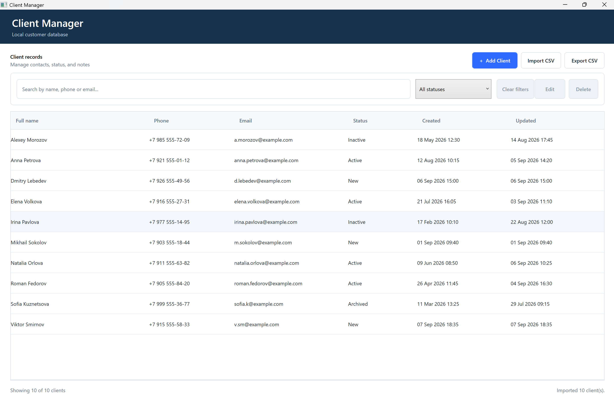
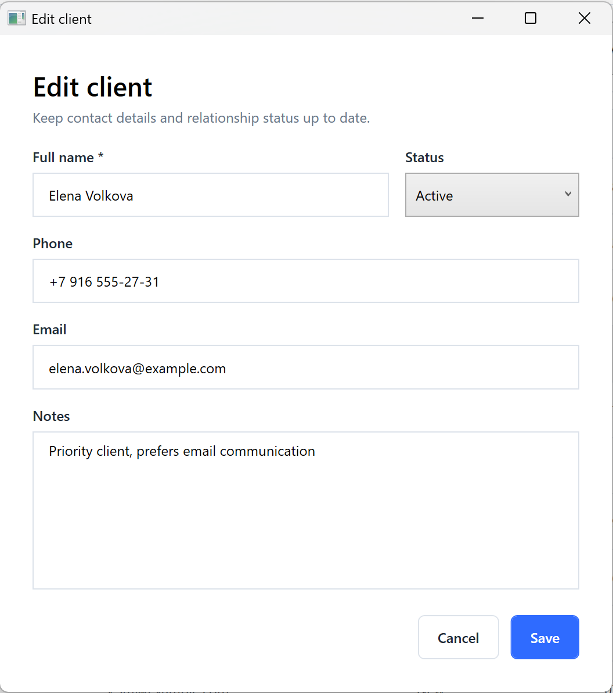

# Client Manager

A lightweight local desktop application for managing customer records, built with WPF and .NET 8. Client Manager stores contact details, relationship status, and notes in a local SQLite database—no account or cloud service required.

## Screenshots



_Main client management interface_



_Client editing dialog_

Future real captures can be added under `docs/screenshots/` for search and filtering (`search-filter.png`) and CSV workflows (`csv-import-export.png`).

## Features

- Create, edit, and delete clients
- Search by name, phone, and email
- Filter and sort client records
- Clear active filters in one action
- Warn about potential duplicates by matching email address or phone number
- Import and export UTF-8 CSV files
- Validate client input before it reaches the database
- Keep data in a local SQLite database
- Use asynchronous data access and show progress for longer operations
- Provide empty states and user-friendly error messages
- Record application events and failures in a local log without client data

## Technology Stack

- C# / .NET 8
- WPF
- MVVM
- Entity Framework Core
- SQLite
- Microsoft.Extensions.DependencyInjection
- Microsoft.Extensions.Logging
- xUnit

## Architecture

The solution keeps presentation, domain logic, persistence, and tests separate:

- `Portfolio.ClientManager.App` — WPF views, view models, commands, dialogs, logging, and startup configuration
- `Portfolio.ClientManager.Core` — domain models, validation, service contracts, duplicate checks, and CSV processing
- `Portfolio.ClientManager.Infrastructure` — EF Core, SQLite, database initialization, and repository implementations
- `Portfolio.ClientManager.Tests` — unit tests and SQLite integration tests

## Getting Started

### Requirements

- Windows
- .NET 8 SDK

```powershell
git clone https://github.com/ITaEE/client-manager-wpf.git
cd client-manager-wpf
dotnet restore
dotnet build
dotnet run --project Portfolio.ClientManager.App
```

## Tests

Run the automated test suite with:

```powershell
dotnet test
```

The suite contains 21 tests covering client operations, validation, search and filtering, duplicate checks, CSV processing, and SQLite persistence.

## Data Storage and Logging

Client data is stored locally in SQLite at:

```text
%LOCALAPPDATA%\Portfolio.ClientManager\client-manager.db
```

The application creates the directory and database on first launch. Operational events and errors are written to `%LOCALAPPDATA%\Portfolio.ClientManager\logs\client-manager.log`; client names, contact details, and notes are not logged.

## CSV Import / Export

The current search and status-filtered list can be exported as UTF-8 CSV. The importer supports the same format, checks the expected columns, skips malformed or invalid rows, and displays a summary after import.

Imports are saved as a single database operation, so an unexpected database failure does not leave a partially imported batch. Exact duplicate rows are skipped when normalized full name, phone, email, status, and notes match an existing client or an earlier row in the same import. Matching is case-insensitive and ignores leading and trailing whitespace.

When creating or editing an individual client, matching an existing email address or phone number produces a warning; the user can cancel or explicitly save the record anyway.

## Publish for Windows x64

Create a self-contained Windows x64 build for users who do not have the .NET runtime installed:

```powershell
dotnet publish Portfolio.ClientManager.App\Portfolio.ClientManager.App.csproj --configuration Release --runtime win-x64 --self-contained true --output .\artifacts\publish\win-x64
```

The executable and its supporting files will be in `artifacts/publish/win-x64`.

## Release

After v1.0.0 is published, the self-contained Windows x64 build can be downloaded from [GitHub Releases](https://github.com/ITaEE/client-manager-wpf/releases).

## Portfolio Highlights

- WPF desktop development
- MVVM architecture
- Dependency Injection
- EF Core and SQLite
- Asynchronous programming
- Validation and duplicate detection
- CSV file processing
- Local operational logging
- Automated testing
- Layered application design

## Project Status

Portfolio project — feature complete for the current release.

## Roadmap

Possible future improvements:

- Dark theme
- Advanced filtering
- Client history
- MSIX installer

## License

Distributed under the [MIT License](LICENSE).
